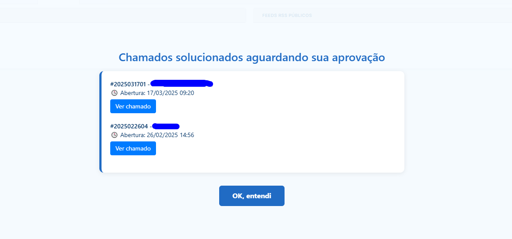

# Plugin GLPI - TicketsPopup

Plugin desenvolvido para exibir automaticamente uma **notificação pop-up após o login** com a lista de chamados pendentes de aprovação, planejados ou aguardando validação, de forma personalizada por perfil, usuário e tipo de ticket.
---

## ✨ Funcionalidades

- 🛎️ Receba um alerta automático via pop-up ao entrar no sistema sempre que houver tickets pendentes de aprovação, planejados ou aguardando validação.
- 👤 Filtro inteligente por usuário logado (requerente, técnico, observador etc.).
- ⚙️ Configuração para ativar ou desativar o pop-up conforme a necessidade / administrador
---

## 🧑‍💼 Público-alvo

Todos os usuários que precisam aprovar chamados ou ver os chamados que foram planejados.

---

## 🚀 Instalação

1. Acesse a pasta `plugins/` no diretório da sua instalação do GLPI.
2. Extraia o conteúdo deste plugin dentro da pasta `ticketsapprovalpopup/`.
3. Vá em **GLPI > Configurar > Plugins** e clique em **Instalar** e depois **Ativar**.
4. Acesse o menu de configuração do plugin para definir os filtros e perfis.

---

## 📇 Créditos

Desenvolvido por:

**David Ebsen**  
GitHub: [https://github.com/davidebsen](https://github.com/davidebsen)  
LinkedIn: [https://www.linkedin.com/in/david-ebsen/](https://www.linkedin.com/in/david-ebsen/)

---

Distribuído sob licença **GPLv3+**
