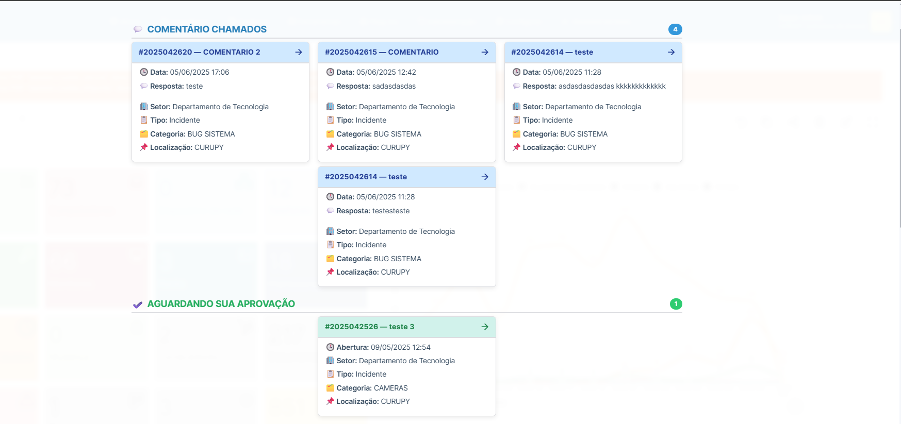
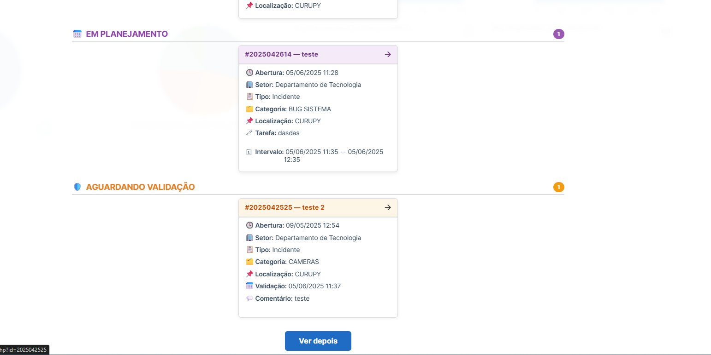

# Plugin GLPI - TicketsPopup

Plugin desenvolvido para exibir automaticamente uma **notificação pop-up após o login** com a lista de chamados pendentes de aprovação, planejados, pendentes de validação ou chamados comentados para o técnico atribuído, de forma personalizada por perfil, usuário e tipo de ticket. O front foi totalmente reestruturado, proporcionando uma visão mais clara e objetiva das informações.

---

## ✨ Funcionalidades

- 🛎️ Receba um alerta automático via pop-up ao entrar no sistema sempre que houver:  
  - Chamados pendentes de aprovação  
  - Chamados planejados  
  - Chamados aguardando validação  
  - Chamados comentados para o técnico atribuído 
- 👤 Filtro inteligente por usuário logado (requerente, técnico, observador etc.).
- Ícones pequenos e espaçamento reduzido, deixando os cards mais compactos e fáceis de ler, sem espaços vazios indesejados.  
- 🎨 **Front reestruturado**: interface mais limpa, cores destacadas e disposição otimizada para facilitar a leitura rápida dos chamados.  
- ⚙️ Configuração para ativar ou desativar o pop-up conforme a necessidade (administrador).

---

## 🧑‍💼 Público-alvo

Todos os usuários que precisam aprovar chamados, ver chamados planejados ou avaliar chamados que possuem comentários atribuídos a eles como técnicos.

---

## 🚀 Instalação

1. Acesse a pasta `plugins/` no diretório da sua instalação do GLPI.  
2. Extraia o conteúdo deste plugin dentro da pasta `ticketsapprovalpopup/`.  
3. Vá em **GLPI > Configurar > Plugins** e clique em **Instalar** e depois **Ativar**.

---

## ⚙️ Configuração

Depois de ativar o plugin, acesse **Administração > Plugins > TicketsPopup > Configurações** para ativar ou desativar o pop-up. Não há necessidade de ajustes adicionais para o recurso de “Chamados Comentados” — ele já estará automaticamente estilizado conforme descrito acima.

---

## 📇 Créditos

Desenvolvido por:

**David Ebsen**  
GitHub: [https://github.com/davidebsen](https://github.com/davidebsen)  
LinkedIn: [https://www.linkedin.com/in/david-ebsen/](https://www.linkedin.com/in/david-ebsen/)

---

Distribuído sob licença **GPLv3+**
